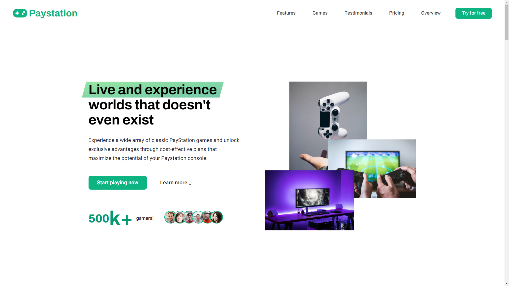

<!-- PROJECT LOGO -->
 
<h1 align="center">TravelSnap</h1>

<!-- ABOUT THE PROJECT -->

## About The Project

Paystation is a fictional company offering games and a subscription service. The landing page is designed to showcase Paystation's products and services while providing an engaging and interactive user experience.
<!-- APPLICATION'S FEATURES -->

## 📝 Features

- **Smooth Scrolling**: enhances user experience by providing seamless transitions between sections of the landing page.
- **Tabbed Component**: enables users to easily access different categories or sections of content within the landing page.
- **Slider Component**: showcases the testimonials section in an interactive and visually appealing manner.
- **Modal Window**: Capture user input in a form without navigating away from the landing page.
- **Accordion**: Accordions allow users to expand and collapse sections of content to manage information efficiently.
- **Subtle Animations**: enhance the landing page's visual appeal and user engagement.
- **Fully Responsive Design**: The landing page is designed to be fully responsive, ensuring optimal viewing and usability across various devices and screen sizes.

<!-- TECHNOLOGY USED -->

## 💻 Technology Used
- **HTML**: HTML provided the structural framework for the landing page, organizing content elements such as headers, paragraphs, images, and forms. Semantic markup enhanced accessibility and SEO.
- **CSS**: CSS styled the visual presentation of HTML elements, including colors, fonts, spacing, and layout. Responsive design techniques and layout tools like Grid, Flexbox, and Absolute Positioning ensured a consistent and adaptable layout across various devices.
- **Javascript**: Added interactive features and dynamic functionality to the landing page. This included smooth scrolling, tabbed navigation, sliders, modal windows, accordions, and subtle animations, enhancing user engagement and usability.

<!-- LIVE DEMO -->

## 🎮 Live Demo

[https://paystation.netlify.app/](https://paystation.netlify.app/)
